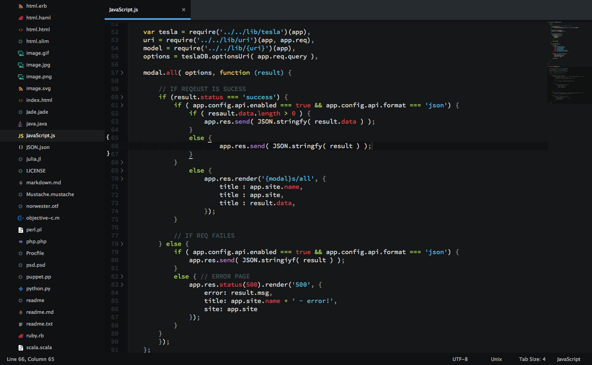
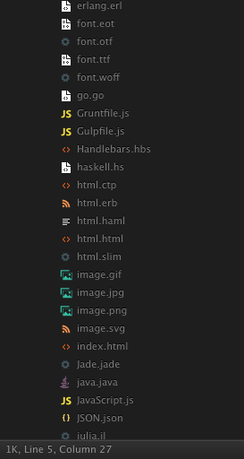

# Brogrammer with SETI icons

Brogrammer is a flat sexy theme. Pushups not included.


# Seti UI Icons for Sublime Text

These icons have been lifted from the [Seti_ST3](https://github.com/ctf0/Seti_ST3) Sublime Text port of [jesseweed's](https://github.com/jesseweed/seti-ui) Github Atom theme. You can use it with any other Sublime theme you like, but only if they're dark - [Soda Dark](https://github.com/buymeasoda/soda-theme/) works especially well.

The screenshots below show





## Install


### Manual

1. [Download the .zip](https://github.com/ankushdharkar/brogrammer-theme/archive/master.zip)
2. Unzip and rename the folder to `Theme - Brogrammer`
3. Copy the folder into `Packages` directory, which you can find using the menu item `Preferences -> Browse Packages...` in Sublime Text

## Setup

Activate the UI theme and color scheme by modifying your user preferences file, which you can find using the menu item `Preferences -> Settings - User` in Sublime Text or by clicking `cmd + ,` on a Mac.

### Example settings
```
{
  "theme": "Brogrammer.sublime-theme",
  "color_scheme": "Packages/Theme - Brogrammer/brogrammer.tmTheme"
}
```


### Credits
- Seti UI port by [ctf0](https://github.com/ctf0/Seti_ST3)
- Theme is originally by [jesseweed](https://github.com/jesseweed/seti-ui) for Github's Atom editor.
- SetiUI-Icons-Sublime was ported by [mrmartineau](https://github.com/mrmartineau/SetiUI-Icons-Sublime)

## File Icons Notes
- There is a folder included with some files types from `jesseweed` and `DanBrooker` to test the icons.
- Anything less than 'ST3 Build 3062' wont get the sidebar icons to work.

### File Icon Differences from the original

- No file icon in the opened tabs, ST lacks this.
- Not as icon rich as the original because ST can't see anything other than Extensions ,and even though its still hard to use the icon you want.